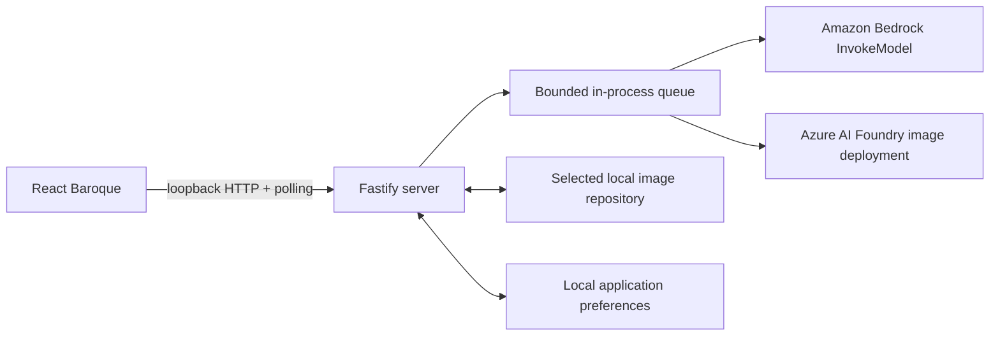

# Local-first architecture

The registered model providers are the only cloud boundaries. The selected local folder is the sole source of truth for repositories, projects, nested assets, style guide folders, generated images, sidecars, and retained run/job state. Failed attempts are discarded after a minimal error is queued transiently in server memory. Application preferences outside the selected folder contain only active and recent canonical repository paths.

## Boundaries

### Source organization

Both applications are organized by feature rather than by a single horizontal component or service layer. The web `app/` directory composes browser features and shared browser-only infrastructure. The server `app/` directory composes Fastify plugins; repository, project, style guide, run, image, and provider behavior stays in its owning feature directory.

Fastify route modules validate public contracts, call an injected service, and map domain records to path-safe DTOs. They do not perform filesystem or provider work. The run facade coordinates dedicated input-staging, durable-record, bounded-queue, generation-worker, and generated-image collaborators while retaining startup-recovery orchestration.

`LocalImageRepository` remains the only authority for resolving repository-relative paths, enforcing containment and symlink rules, and serializing repository mutations. Extracted atomic-file and repository-manager modules cannot be used by feature services to bypass that authority.

Shared package schemas are grouped by resource or durable entity. Their root `index.ts` files only re-export the stable public surface, allowing internal organization to change without widening browser or server boundaries.

### Browser

The browser owns presentation state and non-authoritative preferences. It receives stable IDs and safe metadata, never arbitrary filesystem paths or provider credentials. It submits strict model requests plus an explicit destination and polls run snapshots for authoritative state.

The active provider is derived from the selected target rather than stored separately, so loading a saved image also restores the provider that produced it. The capability response reports only whether each provider resolved server-side credentials, never any credential value.

Addressable state lives in the URL: the visible view is a route, the selected project is a route parameter, and the loaded image or run is a Zod-validated search parameter holding an identifier only. Identifiers are resolved against cached query data at render time, so a link that no longer resolves degrades to its underlying view. Loading a saved image also restores the prompt, tool, and destination it was produced with, so viewing and remixing are the same gesture and generating from the restored draft simply creates a new image. Repository-scoped state is mounted under a key derived from the active repository, which is what prevents drafts, destinations, and optimistic runs from crossing a repository switch.

### Loopback server

Fastify binds to loopback and validates Host and Origin headers. It owns repository selection, manifest validation, project and style guide APIs, durable run creation, local queueing, input hydration, provider invocation, output persistence, and ID-resolved content delivery.

Each provider adapter owns its own wire format: it builds the request payload from the validated normalized request, decodes and validates the response, and raises provider-side filtering or refusal as an error. Callers receive only decoded image data and non-secret provenance, so adding a provider does not change the run pipeline.

The macOS directory selector is an injectable adapter. Production uses `/usr/bin/osascript` through `execFile`.

### Local repository

`LocalImageRepository` centralizes every filesystem operation. It canonicalizes the root, validates repository-relative paths, rejects traversal and symlink components, checks root containment after resolution, validates JSON with Zod, and serializes mutations with an in-process lock.

JSON and preferences use same-directory temporary files, file synchronization, rename, and directory synchronization. Immutable image bytes use an exclusive temporary file and hard-link publication, preventing overwrite. Abandoned temporary files are removed during repository reopening.

Stable UUIDs define identity. Slugs are display-derived directory components only; renaming a project, project asset, style guide folder, or style guide image updates its manifest without changing identity.

## Generation lifecycle

1. `POST /api/runs` validates the target, normalized request, seed plan, and destination. A run becomes one job per requested output, or a single job carrying the run's output count in `n` when the target batches images into one call.
2. Local uploads and style guide images are inspected, hashed, and snapshotted as immutable repository inputs. Durable run and job JSON records are committed before queueing.
3. The bounded queue processes conservatively at concurrency one by default. Queue items retain their originating repository instance and resolved destination even if the user switches repositories.
4. Immediately before invocation, the worker re-reads every input, verifies its SHA-256, and replaces opaque image IDs with base64 in memory.
5. The target's provider adapter sends the capability payload with retries disabled and validates the response against that provider's strict schema.
6. Provider output is strictly decoded, inspected, hash-calculated, and written byte-exact to `images/`, a project `images/`, or a nested asset `images/`.
7. A strict adjacent `.image.json` sidecar records reproducibility and provenance without base64 data, credentials, or unrestricted absolute paths.
8. Successful, cancelled, and interrupted job/run records are updated, and browser polling observes their state. A failed attempt instead removes its job record, partial outputs, and unreferenced staged inputs, so a batched job discards every image it produced. If no jobs remain, its run record is removed too; polling receives only a one-shot in-memory error notification.

Project and project-asset descriptions are not inputs to this lifecycle and cannot alter provider prompts.

## Restart and cancellation semantics

Queued jobs are durable and are re-enqueued when the active repository opens. A job found in `running` state is changed to `interrupted`; its active attempt becomes `ambiguous`. Automatic retry is prohibited because provider acceptance and billing may already have occurred. An interrupted run is re-run deliberately by generating again from its restored prompt and settings, which creates a new run and attempt history.

Cancellation removes queued jobs honestly. Once an invocation is active, cancellation cannot reliably stop the remote call; it is allowed to complete and records the known outcome.

## Content access

Generated and style guide content routes accept UUIDs only. Services locate and validate the corresponding manifest, verify hashes before reads where applicable, and then serve private loopback content. Gallery/history DTOs omit repository paths, and the strict sidecar stays on disk as the authoritative provenance record.

Polling remains the authoritative browser update mechanism. The browser turns transient generation failures into pop-up errors, removes discarded optimistic runs from recents and history, and returns a loaded failed run to the unchanged prompt and settings.
