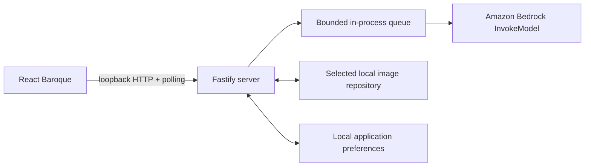

# Local-first architecture

Amazon Bedrock is the only cloud boundary. The selected local folder is the sole source of truth for repositories, projects, nested assets, references, generated images, sidecars, and retained run/job state. Failed attempts are discarded after a minimal error is queued transiently in server memory. Application preferences outside the selected folder contain only active and recent canonical repository paths.

## Boundaries

### Source organization

Both applications are organized by feature rather than by a single horizontal component or service layer. The web `app/` directory composes browser features and shared browser-only infrastructure. The server `app/` directory composes Fastify plugins; repository, project, reference, run, image, and provider behavior stays in its owning feature directory.

Fastify route modules validate public contracts, call an injected service, and map domain records to path-safe DTOs. They do not perform filesystem or provider work. The run facade coordinates dedicated input-staging, durable-record, bounded-queue, generation-worker, and generated-image collaborators while retaining startup-recovery orchestration.

`LocalImageRepository` remains the only authority for resolving repository-relative paths, enforcing containment and symlink rules, and serializing repository mutations. Extracted atomic-file and repository-manager modules cannot be used by feature services to bypass that authority.

Shared package schemas are grouped by resource or durable entity. Their root `index.ts` files only re-export the stable public surface, allowing internal organization to change without widening browser or server boundaries.

### Browser

The browser owns presentation state and non-authoritative preferences. It receives stable IDs and safe metadata, never arbitrary filesystem paths or AWS credentials. It submits strict model requests plus an explicit destination and polls run snapshots for authoritative state.

### Loopback server

Fastify binds to loopback and validates Host and Origin headers. It owns repository selection, manifest validation, project/reference APIs, durable run creation, local queueing, input hydration, Bedrock invocation, output persistence, and ID-resolved content delivery.

The macOS directory selector is an injectable adapter. Production uses `/usr/bin/osascript` through `execFile`; tests inject a fixed selector and never open native UI.

### Local repository

`LocalImageRepository` centralizes every filesystem operation. It canonicalizes the root, validates repository-relative paths, rejects traversal and symlink components, checks root containment after resolution, validates JSON with Zod, and serializes mutations with an in-process lock.

JSON and preferences use same-directory temporary files, file synchronization, rename, and directory synchronization. Immutable image bytes use an exclusive temporary file and hard-link publication, preventing overwrite. Abandoned temporary files are removed during repository reopening.

Stable UUIDs define identity. Slugs are display-derived directory components only; renaming a project, project asset, reference folder, or reference image updates its manifest without changing identity.

## Generation lifecycle

1. `POST /api/runs` validates the target, normalized request, seed plan, and destination.
2. Local uploads and references are inspected, hashed, and snapshotted as immutable repository inputs. Durable run and job JSON records are committed before queueing.
3. The bounded queue processes conservatively at concurrency one by default. Queue items retain their originating repository instance and resolved destination even if the user switches repositories.
4. Immediately before invocation, the worker re-reads every input, verifies its SHA-256, and replaces opaque image IDs with base64 in memory.
5. The direct Bedrock adapter sends the exact capability payload with SDK retries disabled. The strict capability response schema validates the response.
6. Provider output is strictly decoded, inspected, hash-calculated, and written byte-exact to `images/`, a project `images/`, or a nested asset `images/`.
7. A strict adjacent `.image.json` sidecar records reproducibility and provenance without base64 data, credentials, or unrestricted absolute paths.
8. Successful, cancelled, and interrupted job/run records are updated, and browser polling observes their state. A failed attempt instead removes its job record, partial outputs, and unreferenced staged inputs. If no jobs remain, its run record is removed too; polling receives only a one-shot in-memory error notification.

Project and project-asset descriptions are not inputs to this lifecycle and cannot alter provider prompts.

## Restart and cancellation semantics

Queued jobs are durable and are re-enqueued when the active repository opens. A job found in `running` state is changed to `interrupted`; its active attempt becomes `ambiguous`. Automatic retry is prohibited because provider acceptance and billing may already have occurred. The UI offers explicit retry, which creates a new run and attempt history.

Cancellation removes queued jobs honestly. Once an invocation is active, cancellation cannot reliably stop the remote call; it is allowed to complete and records the known outcome.

## Content and metadata access

Generated and reference content routes accept UUIDs only. Services locate and validate the corresponding manifest, verify hashes before reads where applicable, and then serve private loopback content. Gallery/history DTOs omit repository paths. The metadata endpoint intentionally exposes repository-relative provenance paths from the strict sidecar, never absolute paths.

Polling remains the authoritative browser update mechanism. The browser turns transient generation failures into pop-up errors, removes discarded optimistic runs from recents and history, and returns an open failed-run editor to the unchanged prompt and settings.
