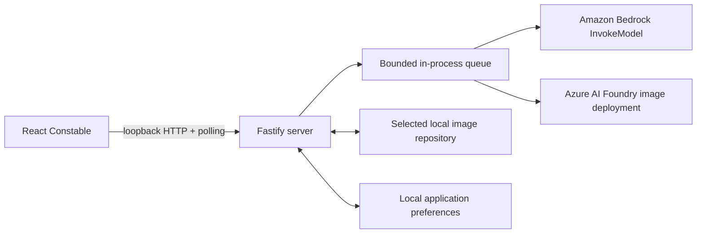

# Local-first architecture

The registered model providers are the only cloud boundaries. The selected local folder is the sole source of truth for repositories, style guide folders, saved presets and their covers, generated images, sidecars, and retained run/job state. Failed attempts are discarded after a minimal error is queued transiently in server memory. Application preferences outside the selected folder contain only active and recent canonical repository paths.

## Boundaries

### Source organization

Both applications are organized by feature rather than by a single horizontal component or service layer. The web `app/` directory composes browser features and shared browser-only infrastructure. The server `app/` directory composes Fastify plugins; repository, style guide, run, image, and provider behavior stays in its owning feature directory.

Fastify route modules validate public contracts, call an injected service, and map domain records to path-safe DTOs. They do not perform filesystem or provider work. The run facade coordinates dedicated input-staging, durable-record, bounded-queue, generation-worker, and generated-image collaborators while retaining startup-recovery orchestration.

`LocalImageRepository` remains the only authority for resolving repository-relative paths, enforcing containment and symlink rules, and serializing repository mutations. Extracted atomic-file and repository-manager modules cannot be used by feature services to bypass that authority.

Shared package schemas are grouped by resource or durable entity. Their root `index.ts` files only re-export the stable public surface, allowing internal organization to change without widening browser or server boundaries.

### Browser

The browser owns presentation state and non-authoritative preferences. It receives stable IDs and safe metadata, never arbitrary filesystem paths or provider credentials. It submits strict model requests and polls run snapshots for authoritative state. All generated images belong to the selected repository's main image collection.

Settings retains its selected section in shell state when closed and restores it, along with each section's scroll position, when reopened by the Settings button or keyboard shortcut. Actions that require a repository still open the Repository section directly.

Appearance offers Sans (the existing default stack), Serif (Georgia), and Mono (system monospace) font options with live previews. Fonts use local typefaces only, apply throughout the interface, and are saved in browser storage independently of the theme and active repository.

Shortcuts uses one shared set of bindings for its editor, runtime handlers, and Generate hint. The four app actions can be recorded, removed, or reset individually; resetting all bindings requires confirmation. Bindings are stored in browser storage and validated with a strict schema, including duplicate and known reserved-combination checks. Invalid stored preferences surface inline while defaults remain usable. Recording requires Command or Ctrl, preserves Tab navigation, and uses Escape to cancel without closing Settings. Global commands do not run inside dialogs; Create remains scoped to the prompt. Matching uses the produced key and exact modifiers, ignores repeats, composition, and AltGr, and leaves Escape and standard text editing unchanged. Browser and operating-system shortcuts cannot all be intercepted or reassigned.

The editor follows [VS Code's change, remove, reset, and conflict patterns](https://code.visualstudio.com/docs/configure/keybindings), [W3C guidance on avoiding accidental character-shortcut activation](https://www.w3.org/WAI/WCAG22/Understanding/character-key-shortcuts.html), and [WAI-ARIA dialog focus and keyboard guidance](https://www.w3.org/WAI/ARIA/apg/patterns/dialog-modal/). A short action list needs no search or multi-step chords; explicit Save/Cancel and reset confirmation are product choices rather than WCAG requirements.

The toolbar's model dropdown combines both providers within each workflow; there is no separate provider setting. The provider is derived from the selected target, so loading a saved image also restores the provider that produced it. Models whose provider is unconfigured remain visible but disabled with setup guidance. The capability response reports only whether each provider resolved server-side credentials, never any credential value.

Negative prompt appears as a text-only toolbar button for supported targets, not as a second canvas field. Its multiline editor reuses the image-count control's anchored popover, shared width, and small height limit. Longer text scrolls inside the editor with a thin, theme-colored vertical scrollbar rather than expanding the popover. Opening focuses the textarea, and Escape closes the popover and restores focus to its button. Changes immediately update the persisted generation settings; closing does not discard them. The button's width and adjacent gap account for the toolbar's extra width, while the bottom workflow tabs grow equally.

GPT Image 2 exposes a 16-image input limit in its capability metadata. Create keeps optional reference images separate from the output preview; Edit uses a source followed by up to 15 references, with its optional mask bound only to the source. Applying a style guide does not switch GPT Create into Edit or alter the prompt. Temporary references retain request order in a vertically scrollable stack anchored to the workspace's right edge, outside normal layout flow, so adding or removing them does not shift the prompt or resize working images. Its scrollport uses the canvas grid rows above the toolbar so reference controls cannot disappear behind the toolbar on narrow screens. Previews share a responsive height capped at 180 px and retain their natural aspect ratios; widths are not normalized against other images. Each image is shifted outward by 20% of its width and uses a repeating preset tilt (-15, 8, -6, and 12 degrees). There is no framing, rounding, caption, or numbering, and an unboxed X overlays the top-left corner. The stack uses its own view-transition layer alongside the style guide and toolbar. Style-guide previews stay in the left stack and can be excluded through the guide panel. References alone never reserve a main image area, and excess or unsupported inputs block submission.

Pending outputs reserve an image-shaped skeleton rather than displaying progress text or a spinner on the canvas. Its aspect ratio comes from the submitted request, including explicit provider pixel sizes, and is carried through optimistic state and the safe polled run DTO without exposing request bodies. A source-based operation without explicit dimensions keeps the displayed source's shape until the output is measured. `StudioImage` combines run/job state and saved-image metadata into one presentation model for the gallery and canvas. Each durable job/output keeps the same presentation identity as its pixels arrive, including out-of-order job completion; saved-image DTOs supply the job identifier and exact aspect ratio from the existing sidecar. Both states use `GeneratedImageCard` and `ImageFrame`, so loading changes the frame's contents rather than creating a different kind of gallery item. Completed-run placeholders bridge the gap until the saved-image query catches up, without retaining placeholders for files missing from a newer repository snapshot. Shimmer respects reduced-motion preferences. Create always exposes an icon-only Reset settings control to the left of the toolbar, vertically centered, with a "Reset settings" hover label; images have no output-preview caption.

Feedback stays inline in the feature that owns the action; there is no toast stack or transient success notification. Errors can be dismissed or cleared by another attempt.

Saved presets open in an ungrouped, style-guide-like overlay above the current canvas. Clicking a card appends its prompt, separated by a blank line, and leaves the picker open; the 10,000-character composer limit is enforced before appending. The card's inline Added label acknowledges additions rather than toggling an active preset. The canvas launcher is a large bookmark tilted toward north-northwest and partly tucked beyond the left edge, with a centered plus matching the fan's add tile. It uses the style-guide cards' muted fill and dashed outline, independent of the current prompt. Motion honors reduced-motion preferences. Covers can be selected from the gallery or uploaded, and remain decorative library metadata: neither the cover nor the preset name changes provider inputs.

Addressable state lives in the URL: the visible view is a route, and the loaded image or run uses Zod-validated identifiers plus an optional nonnegative output index for selecting a specific image in a batch, including pending outputs. Output arrows update that same address. Identifiers are resolved against cached query data at render time, so a link that no longer resolves degrades to its underlying view. Loading a saved image also restores its prompt and tool, so viewing and remixing are the same gesture and generating from the restored draft simply creates a new image. Repository-scoped state is mounted under a key derived from the active repository, which prevents drafts and optimistic runs from crossing a repository switch.

Gallery routes reveal a quieter overview of the same sheet: the working canvas stays mounted but hidden, along with its generation toolbar, while style-guide and preset shortcuts are absent. Saved-image DTOs drive individual uncropped thumbnails in newest-first order, including every output of a multi-image run. Pending images occupy skeletons at the front of the same grid instead of a progress banner or an empty-gallery message. Headings, captions, sequence labels, image overlays, and a zoom readout are omitted. Matching circular Settings and gallery/create controls share the same screen-edge insets. Run polling supplies a compact activity list for stopped runs and inline errors when needed.

The cutting mat uses coarser grid divisions in the overview, and its vertical ruler follows scrolling without rerendering the workspace. Ruler bands remain live and stationary outside the view-transition snapshots; their ticks and fixed-size numeric labels move on the camera animation's clock instead of fading between measurements. `ImageFrame` alone registers the selected artwork with the shared sheet transition, regardless of whether it contains a skeleton or decoded pixels. Its measured bounds define the same reversible camera transform in both directions; navigation decodes available images before capturing its target but does not require pixels to animate a frame. Saved aspect ratios establish the frame geometry before decoding. Animation and camera changes therefore apply to pending and saved images through the same path. Focused image/run identifiers and the mounted canvas preserve the draft and preview. Browser history restores the inner scroll position. Reduced-motion preferences disable the camera and ruler animations.

### Loopback server

Fastify binds to loopback and validates Host and Origin headers. It owns repository selection, manifest validation, style guide APIs, durable run creation, local queueing, input hydration, provider invocation, output persistence, and ID-resolved content delivery.

Each provider adapter owns its own wire format: it builds the request payload from the validated normalized request, decodes and validates the response, and raises provider-side filtering or refusal as an error. Callers receive only decoded image data and non-secret provenance, so adding a provider does not change the run pipeline.

The Foundry adapter chooses `images/edits` whenever the request contains images, including reference-assisted Create requests; otherwise Create uses `images/generations`. Image arrays become ordered multipart `image[]` parts. The effective operation is recorded in non-secret provenance. Only the run-upload route increases its bounded body limit to accommodate sixteen 10 MiB base64 images plus a mask and JSON overhead.

GPT Image capabilities accept `negative_prompt` as a harness-only normalized field. The Foundry adapter removes it from the provider payload and appends `\n\nAvoid: <trimmed negative prompt>` to `prompt` only when nonempty, before either JSON or multipart serialization. The original normalized request is never mutated, so queued jobs and sidecars retain the user's positive and negative prompts separately; provider metadata additionally records the exact combined `effectivePrompt`. With no negative prompt, the original provider prompt is unchanged. Bedrock continues to receive its native `negative_prompt`.

The macOS directory selector is an injectable adapter. Production uses `/usr/bin/osascript` through `execFile`.

### Local repository

`LocalImageRepository` centralizes every filesystem operation. It canonicalizes the root, validates repository-relative paths, rejects traversal and symlink components, checks root containment after resolution, validates JSON with Zod, and serializes mutations with an in-process lock.

JSON and preferences use same-directory temporary files, file synchronization, rename, and directory synchronization. Immutable image bytes use an exclusive temporary file and hard-link publication, preventing overwrite. Abandoned temporary files are removed during repository reopening.

Stable UUIDs define identity. Slugs are display-derived directory components only; renaming a style guide folder or style guide image updates its manifest without changing identity.

Saved presets use `presets/<slug>--<preset-id>/preset.json`. Each optional cover is an immutable image with a strict adjacent `.image.json` sidecar. Gallery selections are copied byte-exactly into the preset, so changing or deleting a preset cannot change the original generated image. Preset manifests and browser query caches are scoped to their owning repository; prompt text and cover bytes are not stored in browser local storage.

## Generation lifecycle

1. `POST /api/runs` validates the target, normalized request, and seed plan. A run becomes one job per requested output, or a single job carrying the run's output count in `n` when the target batches images into one call.
2. Local uploads and style guide images are inspected, hashed, and snapshotted as immutable repository inputs. Array order and scalar compatibility are preserved, with one input record per occurrence even when a snapshot is shared. Reference lookups and output paths use the captured repository. Durable run and job JSON records are committed before queueing.
3. The bounded queue processes conservatively at concurrency one by default. Queue items retain their originating repository instance even if the user switches repositories.
4. Immediately before invocation, the worker validates the saved request, checks each opaque reference against its ordered input record, re-reads every input, verifies its SHA-256, and replaces image IDs with base64 in fresh in-memory arrays. Stored request arrays remain unchanged for sidecars and recovery.
5. The target's provider adapter sends the capability payload with retries disabled and validates the response against that provider's strict schema.
6. Provider output is strictly decoded, inspected, hash-calculated, and written byte-exact to `images/`.
7. A strict adjacent `.image.json` sidecar records reproducibility and provenance without base64 data, credentials, or unrestricted absolute paths.
8. Successful, cancelled, and interrupted job/run records are updated, and browser polling observes their state. A failed attempt instead removes its job record, partial outputs, and unreferenced staged inputs, so a batched job discards every image it produced. If no jobs remain, its run record is removed too; polling receives only a one-shot in-memory error notification.

## Restart and cancellation semantics

Queued jobs are durable and are re-enqueued when the active repository opens. A job found in `running` state is changed to `interrupted`; its active attempt becomes `ambiguous`. Automatic retry is prohibited because provider acceptance and billing may already have occurred. An interrupted run is re-run deliberately by generating again from its restored prompt and settings, which creates a new run and attempt history.

Cancellation removes queued jobs honestly. Once an invocation is active, cancellation cannot reliably stop the remote call; it is allowed to complete and records the known outcome.

## Content access

Generated and style guide content routes accept UUIDs only. Services locate and validate the corresponding manifest, verify hashes before reads where applicable, and then serve private loopback content. Gallery/history DTOs omit repository paths, and the strict sidecar stays on disk as the authoritative provenance record.

Polling remains the authoritative browser update mechanism. The browser displays transient generation failures inline on Create and in gallery activity, removes discarded optimistic runs from recents and history, and clears a discarded run's focus without leaving the current view or changing its prompt and settings.
